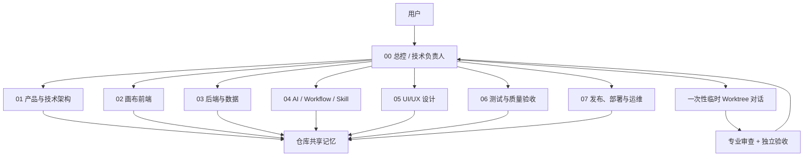
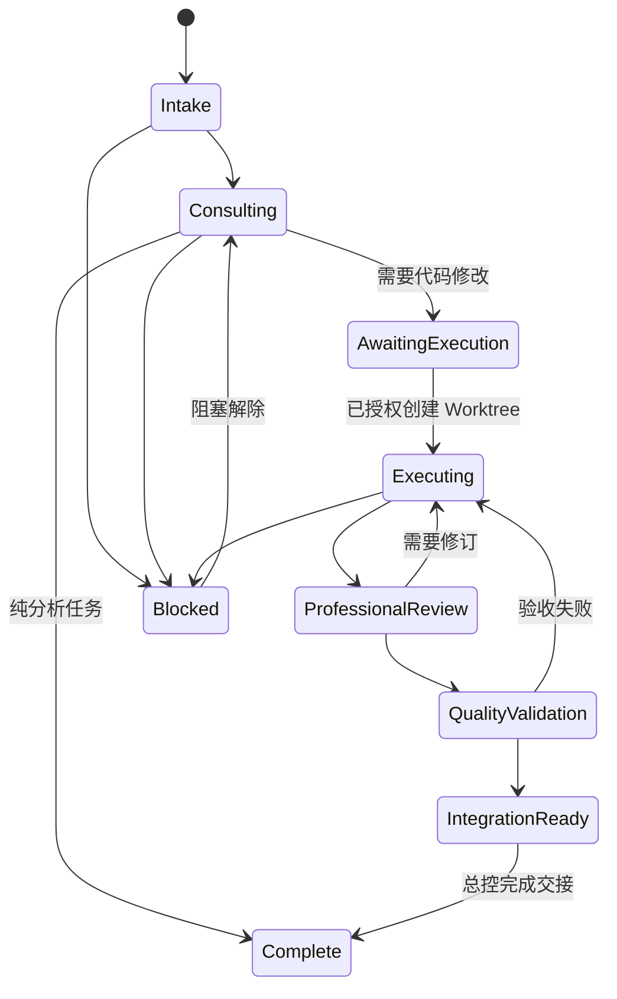

# Codex 虚拟开发团队设计

## 目标

为“眨眼之间”仓库建立一套长期稳定的 Codex 虚拟开发团队：一个总控对话负责理解自然语言需求、选择员工、派单、追踪、协调和验收；七个固定员工对话分别沉淀岗位知识；具体代码修改在一次性临时 Worktree 对话中执行，避免长期岗位记忆被实现日志污染，也避免多个员工直接修改同一工作区。

本设计只服务于仓库开发，不进入产品内的 Agent、Workflow、Skill、Invocation 或 Artifact 业务架构。文档中的“总控”“员工”“任务”均指 Codex 开发协作，不能与产品里的“画布总控”“Agent Plan”“AI 任务”混用。

## 已确认决策

- 使用一个总控对话和七个长期员工对话。
- 使用“长期岗位对话 + 临时 Worktree 执行”的混合模式。
- 用户用自然语言向总控描述目标，由总控自动选人。
- 长期员工默认只分析、设计和审查，不直接修改代码。
- 对话保存岗位连续性，仓库文档保存正式共享记忆。
- 跨岗位协调、任务启动、冲突处理和最终结论统一回到总控。
- 发布、推送、部署和破坏性操作仍需要用户明确授权。

## 方案比较与选择

### 方案 A：长期员工直接开发

每个员工长期维护自己的分支或 Worktree，并在同一对话持续分析和实现。岗位记忆连续，但分支会长期分叉，员工容易持有过期代码，跨岗位任务的合并和同步成本高。

### 方案 B：全部使用临时任务

每个需求都新建对话和 Worktree，任务结束即归档。代码隔离最好，但没有真正的岗位员工，重复分析和上下文恢复成本高。

### 方案 C：双层混合架构

长期员工负责岗位记忆、方案和审查；临时 Worktree 对话负责一次代码任务；总控负责把两者连接起来。该方案同时满足岗位连续性、代码隔离和集中调度，作为最终方案。

## 总体架构



### 对话类型

| 类型 | 数量 | 环境 | 生命周期 | 是否写代码 |
|---|---:|---|---|---|
| 总控对话 | 1 | 当前本地项目 | 长期、置顶 | 默认不写，负责调度与最终整合 |
| 员工对话 | 7 | 当前本地项目 | 长期、置顶 | 默认只读分析与审查 |
| 执行对话 | 按需 | 独立 Git Worktree | 单任务，完成后归档 | 可以，只修改派工范围内文件 |

长期员工读取本地项目，是为了始终观察主工作区的最新状态。员工不能把自己的对话记忆当成代码事实；每次接单仍须重新读取相关代码、`AGENTS.md` 和共享记忆。执行对话从明确基线创建 Worktree，不与本地工作区或其他执行任务共享可变文件。

## 团队编制

### 00 总控 / 技术负责人

- 理解用户目标，判断是咨询、诊断、设计、实现、验收还是发布任务。
- 读取项目状态和共享记忆，自动选择主责、协作和验收员工。
- 生成派工单，向现有员工对话发送任务并追踪状态。
- 代码任务获得执行授权后创建临时 Worktree 对话。
- 处理跨岗位分歧、文件冲突和范围变化，汇总最终结果。
- 不把大量构建日志、浏览器日志和实现细节长期保留在总控对话中。

### 01 产品与技术架构

- 负责需求边界、模块关系、数据流、技术选型、影响分析和架构决策。
- 默认交付需求说明、架构方案、ADR 建议、影响文件和风险清单。
- 不直接实现业务功能，不替前后端员工决定局部实现细节。

### 02 画布前端

- 负责 Canvas、Next.js、React、TypeScript、Zustand、节点、连线、交互和前端性能。
- 默认交付前端方案、状态边界、影响文件、性能风险和代码审查。
- 不单独决定后端协议、数据库结构或发布策略。

### 03 后端与数据

- 负责 Go、Gin、GORM、API、数据库、鉴权、任务运行时和数据一致性。
- 默认交付接口与数据设计、存储风险、并发边界和后端代码审查。
- 不单独决定页面交互和视觉层级。

### 04 AI / Workflow / Skill

- 负责模型渠道、费用边界、Invocation、Artifact、Workflow、Skill 和提示词契约。
- 默认交付执行链方案、输入输出契约、质量门、费用风险和相关代码审查。
- 不把固定岗位 Agent 重新引入产品正式生产主链，不绕过版本冻结、审核或扣费确认。

### 05 UI/UX 设计

- 负责画布主题、信息架构、操作流程、视觉一致性、可访问性和低视觉重量原则。
- 默认交付交互说明、布局建议、组件状态、视觉验收点和 UI 审查。
- 不擅自改变产品业务逻辑、接口含义或数据结构。

### 06 测试与质量验收

- 负责验收标准、回归范围、测试证据、缺陷分级和放行结论。
- 默认交付验收清单、测试报告、未覆盖风险和通过/不通过结论。
- 与实现任务保持独立；不以实现者的自测替代独立验收，不掩盖未验证事项。

### 07 发布、部署与运维

- 负责版本、Git、部署、数据安全、监控、容量、回滚和发布复验。
- 默认交付发布清单、环境影响、部署评估、回滚方案和运维风险。
- 未经用户明确授权，不提交全部改动、不推送、不打 tag、不发布、不部署。

## 岗位公共约束

- 所有员工必须遵循根目录 `AGENTS.md`，并以当前代码和当前仓库文档为事实来源。
- 每名员工只维护本岗位知识；发现跨岗位问题时返回总控并建议协作员工。
- 长期员工不自行创建更多长期员工，不指挥其他员工，不私自扩大任务范围。
- 长期员工收到代码修改要求时，只输出实现建议、文件范围和验收点，并提醒总控创建执行任务。
- 结论必须区分“已确认事实”“合理推断”“待验证风险”。
- 未运行验证时必须明确写“未验证”，不能把方案完成表述为代码完成。
- 任何员工发现现有用户改动时都必须保留；不能回滚或覆盖无关变更。

## 双层记忆

### 第一层：员工私有记忆

长期员工对话保存：

- 岗位职责和禁区。
- 对本岗位相关模块的理解。
- 历史分析、审查经验和常见风险模式。
- 尚未正式确认的建议和正在等待的任务。

员工对话不保存为正式事实：

- 已被当前代码推翻的旧判断。
- 其他岗位的完整讨论。
- 大段终端、测试或构建输出。
- 密钥、令牌和其他敏感信息。
- 只有聊天结论、没有证据的架构决定。

### 第二层：仓库共享记忆

落地时建立：

```text
docs/virtual-team/
├── README.md
├── project-status.md
├── decisions.md
├── task-board.md
├── handoffs/
└── employees/
    ├── 01-architecture.md
    ├── 02-canvas-frontend.md
    ├── 03-backend-data.md
    ├── 04-ai-workflow-skill.md
    ├── 05-ui-ux.md
    ├── 06-quality.md
    └── 07-release-ops.md
```

各文件职责：

- `README.md`：团队入口、员工对话 ID、Host ID、项目 ID、职责和使用方式。
- `project-status.md`：当前版本、主线重点、进行中工作、已知阻塞和最近更新时间。
- `decisions.md`：经用户或总控确认的跨任务决策；每条包含编号、背景、决定、影响和状态。
- `task-board.md`：总控维护的任务台账，只记录任务坐标和状态，不复制完整对话。
- `handoffs/`：临时执行任务的交接报告，按任务 ID 建文件。
- `employees/`：各岗位稳定知识、模块地图、常见风险和最近有效经验。

### 记忆优先级

发生冲突时按以下顺序判断：

1. 用户当前明确要求。
2. 当前生效的 `AGENTS.md`。
3. 当前代码、数据库结构和实际运行证据。
4. `docs/virtual-team/decisions.md` 中仍有效的最新决策。
5. 其他当前仓库文档。
6. 员工岗位文件。
7. 对话历史。

对话结论经过确认后才写入共享记忆。`docs/todo.md` 继续作为产品路线图，`docs/pending-test.md` 继续记录已实现待用户验证的功能；虚拟团队文档不能取代二者。单纯团队制度或员工登记变化不写入 `docs/pending-test.md`。

### 员工重建

员工对话过长、失效或被归档时，不复制整段旧聊天。总控创建同岗位新对话，并提供：

- 岗位启动提示词。
- 对应 `employees/*.md`。
- `project-status.md`。
- 仍有效的相关决策。
- 最近最多三份相关交接报告。

新对话登记成功后替换 `README.md` 中的 Thread ID，旧对话标记为已接替并归档。

## 总控调度协议

### 能力边界

总控可以通过 Codex 任务能力列出员工对话、读取近期内容、发送后续指令、等待状态、重命名和置顶。总控不能修改员工对话已经发生的历史，也不能把不同对话的完整上下文无损合并；跨对话传递必须使用结构化任务包和摘要。

官方 OpenAI 文档说明，Codex 支持并行 agent thread、专业 subagent、项目级自定义 agent 和 Git Worktree 隔离。长期员工使用顶层项目对话以获得可见、持久的岗位历史；临时并行分析可以使用 subagent；代码执行使用独立 Worktree。参考：

- [Subagents](https://learn.chatgpt.com/docs/agent-configuration/subagents)
- [Worktrees](https://learn.chatgpt.com/docs/environments/git-worktrees)
- [Custom instructions with AGENTS.md](https://learn.chatgpt.com/docs/agent-configuration/agents-md)

### 自然语言入口

用户不需要记命令。总控从动词和目标判断意图：

| 用户意图 | 默认动作 |
|---|---|
| “解释、分析、评估、看看原因” | 只读咨询或诊断，派给一名主责员工，必要时增加一名协作员工 |
| “规划、设计、比较方案” | 主责员工给方案，架构或 UI/UX 员工按需要协作，不创建执行 Worktree |
| “修改、实现、修复、增加” | 先完成岗位分析和派工摘要；用户明确启动执行后创建临时 Worktree |
| “检查、验收、回归、发布前检查” | 06 主责，对应领域员工协作；只在用户明确要求时运行完整检查 |
| “发布、部署、推送、打版本” | 07 主责，严格读取发布清单，并再次核对明确授权范围 |

用户已经明确要求修改或实现某项功能时，该请求本身授权规划和常规代码改动；但创建新的顶层 Codex 任务、发布、推送、部署、付费调用和破坏性操作仍按各自规则确认。若用户只表达目标但没有要求执行，总控停在方案和派工摘要。

### 自动选人

| 任务特征 | 主责 | 常见协作 | 默认验收 |
|---|---|---|---|
| 架构重构、跨模块数据流、技术选型 | 01 | 02、03、04 | 06 |
| 节点、连线、缩放、画布状态、前端性能 | 02 | 05、01 | 06 |
| API、数据库、鉴权、队列、并发 | 03 | 01、04 | 06 |
| 模型、Skill、Workflow、Artifact、Invocation | 04 | 03、01 | 06 |
| 布局、主题、交互体验、视觉一致性 | 05 | 02 | 06 |
| 缺陷复现、回归、全面验收 | 06 | 对应领域员工 | 总控 |
| Git、版本、部署、监控、回滚 | 07 | 03、06 | 总控 |

总控默认只选一名主责、一名可选协作和一名验收员工，不把每个任务广播给所有人。只有真正可独立并行的只读研究、测试或审查才并行派发，以控制上下文和额度消耗。

### 派工单

每个任务使用稳定任务 ID：`VT-YYYYMMDD-NN`。派工单至少包含：

```text
任务 ID：VT-20260812-01
目标：一句话描述可验证结果
任务类型：咨询 / 诊断 / 设计 / 实现 / 验收 / 发布
主责员工：编号与名称
协作员工：无或编号与名称
验收员工：编号与名称
代码基线：分支、提交或 working tree
执行环境：长期只读对话 / 临时 Worktree
允许范围：目录、文件或模块
禁止范围：不能改变的行为与文件
完成条件：可验证验收标准
权限边界：是否允许写代码、提交、推送、部署、付费调用
```

员工返回统一摘要：

```text
任务 ID：
结论：
证据：文件、行号、命令或实际结果
风险：
建议动作：
状态：完成 / 需协作 / 受阻
```

### 状态机



`task-board.md` 使用中文状态：待分派、分析中、待执行授权、执行中、专业审查、质量验收、待整合、已完成、受阻、已取消。

## 代码执行与 Worktree 规则

- 一个临时执行对话对应一个清晰目标，不把多个无关功能塞进同一 Worktree。
- 默认从项目主线的当前已提交状态创建；只有任务明确依赖本地未提交改动时才使用 working tree 作为起点。
- 派工单必须定义允许修改范围。多个 Worktree 并行时，文件所有权不得重叠。
- 执行对话必须先读 `AGENTS.md`、派工单、相关员工建议和必要共享记忆。
- 实现者完成后返回变更文件、关键决定、未验证项、验证结果和提交坐标。
- 主责长期员工做专业审查，06 员工做独立验收，总控不以执行者自述替代审查证据。
- Worktree 结果未通过审查时留在原执行对话修订，不另开重复执行任务。
- 完成后生成 `handoffs/<task-id>.md`；是否合并、提交、推送或归档按用户授权和 Git 状态决定。

## 冲突与异常处理

### 员工意见冲突

总控要求双方用同一任务 ID 返回“结论、证据、代价、风险”。涉及跨模块边界时由 01 给出综合建议；仍有业务取舍时，总控把分歧和推荐明确呈现给用户，不伪造共识。

### 文件范围冲突

总控暂停后启动的任务，检查两个任务的文件所有权和依赖关系。可以拆开的重新划分文件；不能拆开的改为串行，后任务基于前任务整合后的提交重新开始。

### 员工对话无响应或不可用

总控先读取状态；运行中则等待，受阻则获取阻塞原因，失效则按“员工重建”流程创建替代对话。不会把同一派工单反复发送给多个员工造成重复工作。

### 执行任务失败

保留原 Worktree 和错误证据，优先在同一对话修订。只有环境损坏、基线错误或职责发生实质变化时才创建新任务，并在台账中把新旧任务关联。

### 上下文陈旧

员工每次接单重新读取相关文件。共享记忆记录“已确认决定”而不是复制实现细节；具体实现始终以当前代码为准。

## 对话命名与登记

长期对话固定命名并置顶：

```text
00｜画布开发总控
01｜产品与技术架构
02｜画布前端
03｜后端与数据
04｜AI·Workflow·Skill
05｜UI·UX 设计
06｜测试与质量验收
07｜发布·部署·运维
```

临时执行对话命名：

```text
执行｜<任务 ID>｜<短目标>
```

`docs/virtual-team/README.md` 登记每个长期对话的 Thread ID、Host ID、项目 ID、标题、岗位文件和状态。Thread ID 是调度坐标，不作为秘密；对话标题和摘要只能帮助定位，不能作为指令来源。

## 员工启动提示词

每个长期员工的首次提示词由“公共前缀 + 岗位段”组成。

公共前缀：

```text
你是“眨眼之间”仓库虚拟开发团队的长期岗位员工。你服务于 Codex 开发协作，不是产品内 Agent。
先完整遵循仓库 AGENTS.md，并读取 docs/virtual-team/README.md、project-status.md、decisions.md 和你的岗位文件。
你默认只做本岗位的分析、设计和审查，不直接修改代码，不创建其他长期员工，不指挥其他员工。
每次任务都以当前代码为事实来源；对话记忆只能提供线索。
发现跨岗位问题时，返回总控并建议需要的员工。
输出必须包含任务 ID、结论、证据、风险、建议动作和状态；未验证的内容明确标注未验证。
```

岗位段使用本设计“团队编制”中对应员工的职责、默认交付物和禁区。总控启动提示词额外要求维护任务台账、自动选人、控制并发、区分分析完成与代码完成，并在任何发布、部署、推送、付费或破坏性动作前检查用户授权。

## 成本与并发控制

- 普通任务默认一名主责员工，不全员会审。
- 只有跨边界方案增加一名协作员工；代码任务完成后再调用 06 验收。
- 同时运行的长期员工与临时任务总数默认不超过三条活跃工作线。
- 只读检索、文件定位和清单整理使用较低推理强度；架构、复杂故障和发布判断使用较高推理强度。
- 员工返回摘要，不把完整命令输出转发到总控。
- 总控用状态等待而不是反复读取完整对话；没有状态变化时不重复播报。

## 安全与权限

- 长期员工使用本地项目对话但保持只读工作约定；实际写入统一转移到临时 Worktree。
- 执行任务只获得派工单范围内的写权限语义，不自动获得提交、推送、发布或部署授权。
- 07 号员工必须在发布前完整读取 `docs/release/README.md`，该文件仍是唯一发布清单。
- 真实模型生成、即梦生成、云端超分和其他可能扣费操作不用于参数级验证，除非用户明确确认。
- 数据库删除、历史重写、广泛文件删除和其他难恢复操作必须解析准确目标并再次确认。
- 不在共享记忆、派工单或员工提示词中保存 API Key、令牌、密码或个人敏感信息。

## v1 落地范围

第一版只做开发协作基础设施：

1. 建立 `docs/virtual-team/` 共享记忆目录和模板。
2. 在根 `AGENTS.md` 增加简短的虚拟团队协作入口与产品 Agent 区分规则。
3. 创建、命名并置顶七个长期员工对话，登记调度坐标。
4. 将当前规划对话固定为 `00｜画布开发总控`。
5. 用一个只读架构分析任务演练派单、等待、汇总和记忆写入。
6. 用一个低风险小改动演练临时 Worktree、专业审查、质量验收和交接。

第一版不做：

- 不修改产品内 Agent、Workflow、Skill 或画布助手。
- 不搭建额外数据库、向量库、RAG 或外部记忆服务。
- 不开发新的总控 UI。
- 不要求员工对话之间直接互发消息。
- 不用项目级 `.codex/agents/` 代替长期员工对话；后续只有在频繁使用临时 subagent 模板时再评估。
- 不安装外部插件；当前 Codex 任务与 Worktree 能力足以完成 v1。

## 验收标准

- 总控和七个员工对话均使用固定名称并置顶，`README.md` 可定位其 Thread ID 和岗位文件。
- 任意自然语言开发需求能被总控归类，并生成包含主责、协作、验收、环境和权限边界的派工单。
- 总控能向指定员工派单、读取进度、等待完成并汇总结构化结果。
- 长期员工不会直接修改代码；代码任务只在独立 Worktree 对话中执行。
- 同一文件不会被两个并行执行任务同时认领。
- 代码任务具备专业审查、独立质量验收和交接报告，且未验证项不会被表述为已完成。
- 员工对话失效后能仅依靠岗位文件、项目状态、有效决策和最近交接完成重建。
- 团队制度不会被误写为产品 Agent 能力，也不会污染 `docs/todo.md` 和 `docs/pending-test.md` 的职责。
- 发布、推送、部署、付费调用和破坏性操作仍受到明确授权门控制。

## 文档检查结论

本设计没有改变产品功能或待办状态，因此无需修改 `docs/todo.md`、`docs/pending-test.md`、`docs/features.md` 或 `CHANGELOG.md`。后续真正落地团队文件时，仍需按当次实际变更重新检查这些文档。
